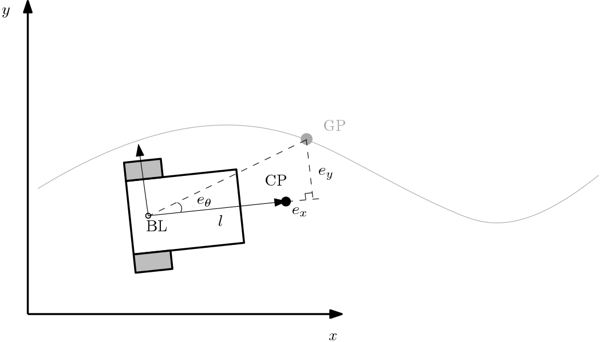
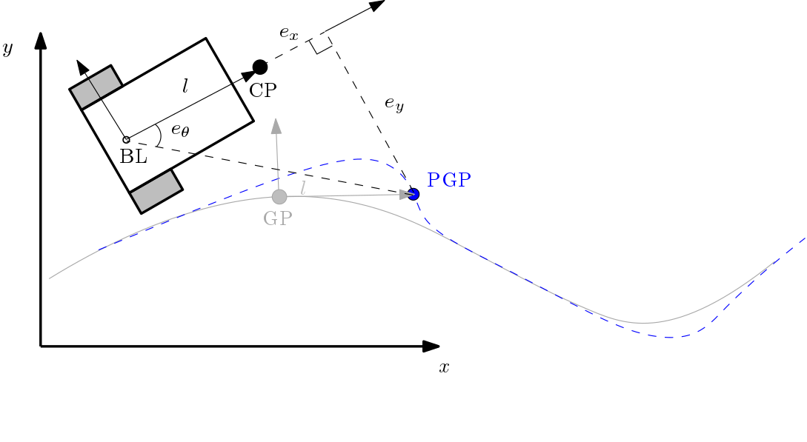
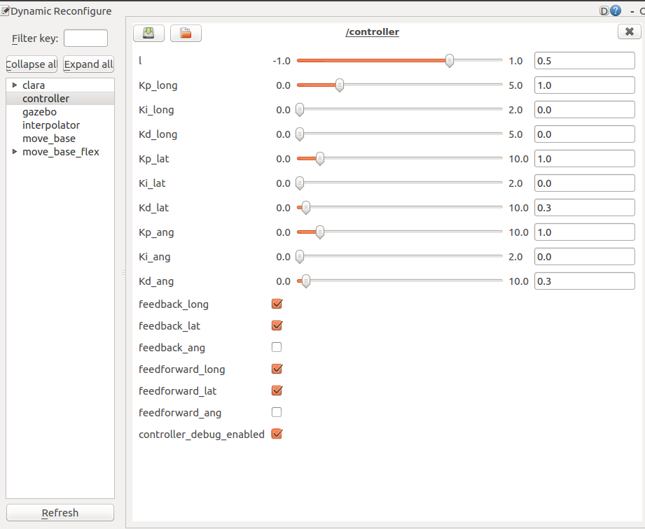

# Tracking_pid

## Overview

Tracking PID offers a tuneable PID control loop to accurately follow a trajectory. An interpolator moves a goal over a ```nav_msgs/Path``` with a tuneable velocity, and a separate node tracks the given point.


One of the tracking options uses a carrot of length l in front of the robot to determine the velocity commands based on the lateral and longitudinal error between current Global Point (GP)  and the Control point (CP):



If a smooth path is provided, the controller has the option to track the path with the base_link directly instead of lagging behind a carrot. In this case a Projected Global Point (PGP) is computed as well which is tracked by the CP. In this mode, the yaw error can also be used as control input.




The PID contains three loops: Longitudinal, lateral and angular loops.

**Keywords:** tracking, pid, local_planner, trajectory

### License

Apache 2.0

**Author: Michiel Franke, Cesar Lopez**

**Maintainer:  Cesar Lopez, cesar.lopez@nobleo.nl.**

**Affiliation: [Nobleo Projects](https://www.nobleo.nl)**


The tracking_pid package has been tested under [ROS] Melodic and Ubuntu 18.04.


## Installation

### Building from Source

#### Dependencies

- [Robot Operating System (ROS)](http://wiki.ros.org) (middleware for robotics),

#### Building

To build from source, clone the latest version from this repository into your catkin workspace and compile the package using

    cd catkin_workspace/src
    git clone https://github.com/nobleo/tracking_pid.git
    cd ../
    catkin_make

### Unit Tests

All tests can be run using:

    catkin build tracking_pid --catkin-make-args run_tests

#### test_controller
Unit test that checks basic tracking functionality of the controller alone

#### test_interpolator
Unit test that checks interpolation between two poses

#### test_tracking_pid.test
Ros system test that checks that interpolator + controller drives a robot to track a given path


## Usage

Run the main node:

    roslaunch tracking_pid test_tracking_pid.test rviz:=true

Or run the tracking node together with a Coverage Path Planner

    roslaunch tracking_pid test_tracking_pid_cpp.launch


Both of these depend on:

[mobile_robot_simulator](https://github.com/mrath/mobile_robot_simulator.git) that integrates /cmd_vel into a /base_link TF-frame and an odometry publisher


tracking_pid test_tracking_pid_local_planner_cpp.launch depends on:

[full_coverage_path_planner](https://github.com/nobleo/full_coverage_path_planner) for CPP global planner

## Configuring in RQT

Tracking_pid parameters are all available through (rqt_)dynamic_reconfigure. The main parameters are:

* **`l`** (float, default: `0.5`);
    Following distance from robot's rotational point to trajectory.

Proportional, Integral and Derivative actions for the three loops: Longitudinal, lateral and angular loops.

* **`Kp_(loop_name)`** (float); Proportional action gain for loop 'loop_name'
* **`Ki_(loop_name)`** (float); Integral action gain for loop 'loop_name'
* **`Kd_(loop_name)`** (float); Derivative action gain for loop 'loop_name'

Each loop can be enabled/disabled separately.

* **`feedback_(loop_name)`** (boolean); Enable feedback loop 'loop_name'

Moreover, feedforward using trajectory velocity can be enabled/disabled.

* **`feedforward_(loop_name)`** (boolean); Enable velocity feedforward for loop 'loop_name'

* **`feedforward_(loop_name)`** (boolean); Enable velocity feedforward for loop 'loop_name'

Coupling between angular and longitudinal control loops. Longitudinal effort is scaled such that: if angular error is smaller than 'dead_zone_yaw_error_cal' no scaling is applied, if it is greater than 'dead_zone_yaw_error_cal' and smaller than 'max_yaw_error_cal', a scaling from 0-1 is applied, if it is greater than 'max_yaw_error_cal' a scaling of 0 is applied.

* **`coupling_ang_long`** (boolean); Enable coupling between angular and longitudinal controllers
* **`dead_zone_yaw_error_cal`** (float); Dead zone in yaw error for coupling between angular and longitudinal controllers
* **`max_yaw_error_cal`** (float); Max yaw error for coupling between angular and longitudinal controllers

The interpolator parameters are also available through (rqt_)dynamic_reconfigure. The main parameters are:

* **`target_x_vel`** (float); The velocity with which the the goal is moved along the path

* **`target_x_acc`** (float); Target x acceleration for use in interpolator

* **`target_yaw_vel`** (float); The velocity with which the goal is moved along the path points with changing yaw

* **`target_yaw_acc`** (float); Target yaw acceleration for use in interpolator


Defaults are shown here



## Launch files

### test/tracking_pid_local_planner/test_tracking_pid_local_planner_cpp.launch

Runs the Tracking PID local planner in combination with the full_coverage_path_planner global planner.
Mobile_robot_simulator is used to integrate cmd_vel output into TF and odometry.

Arguments:

* **`map`**: path to a global costmap. Default: `$(find full_coverage_path_planner)/maps/basement.yaml)`
* **`target_x_vel`**: target x velocity for use in interpolator. Default: `0.5`
* **`target_x_acc`**: target x acceleration for use in interpolator. Default: `0.2`
* **`target_yaw_vel`**: target yaw velocity for use in interpolator. Default: `0.5`
* **`target_yaw_acc`**: target yaw acceleration for use in interpolator. Default: `0.2`
* **`robot_radius`**: radius of the robot for use in the global planner. Default: `0.6`
* **`tool_radius`**: radius of the tool for use in the global planner. Default: `0.2`


Start planning and tracking by giving a 2D nav goal.

### test/test_path_interpolator_topic.launch

Shows the the use of the path_interpolator. A path is published on /path and a target is moved along the path at a given velocity.
Takes no arguments.
If all is well, an orange sphere should move a back-and-forth path covering a square.

### test/test_tracking_pid.test

This launch-file extends test_path_interpolator_topic.launch with the actual tracking_pid controller, wrapped in a node.

Arguments:

* **`rviz`**: launch rviz as well?. Default: `false`

If all is well, a red square moves along a toothed path that covers a square. The square should be followed by the base_link frame.

## Nodes

### path_interpolator

Moves a goal over a path at a given velocity

#### Subscribed topics

* **`/path`** ([nav_msgs/Path])
    The path to follow

* **`/pause`** ([std_msgs/Bool])
    Interpolator stops sending goals when True is received on this topic

#### Published topics

* **`/trajectory`** ([tracking_pid/traj_point])
    The control point at the interpolated goal according to the path and desired velocity

* **`/interpolator_viz`** ([visualization_msgs/Marker])
    A Marker indicating the current interpolated goal along the path

* **`/trajectory_finished`** ([std_msgs/Bool])
    True is published once when the path is finished

#### (Static) Parameters

* **`rate`** (float, default: `50.0`)
    How often must the interpolated be calculated and published?

* **`flip_for_axis`** (float, default: `None`)
    When enabled, the desired following distance between robot and control point (published on `/trajectory`)
    is inverted when the control point moves backwards along the given axis.
    Depending on the robot, this makes the robot drive backwards when moving in the indicated axis.

### controller

Command the robot to stay as close to the target as possible given the tuneable PID parameters.

#### Subscribed Topics

* **`/trajectory`** ([tracking_pid/traj_point])
    Point along the trajectory the robot should follow. This is the current goal for the robot to move to

* **`/tf`** ([tf2_msgs/TFMessage])
    The position of the robot wrt. the frame in which the map is received

#### Published Topics

* **`/cmd_vel`** ([geometry_msgs/Twist])
    The Twist the robot should realize to move towards the current goal as indicated by `/trajectory`.

* **`/tf`** ([tf2_msgs/TFMessage])
    The position of the robot wrt. the frame in which the map is received

* **`/visualization_marker`** ([visualization_msgs/Marker])
    A Marker indicating the current goal the robot is controlled towards

* **`/debug`** ([tracking_pid/PidDebug])
    Intermediate values of the PID controller. Topic is silent by default, can be enabled via dynamic_reconfigure.

#### Services

* **`/enable_control`** ([std_srvs/SetBool])

    Enables/disables the controller. Usefull when a different node should be taking control of the robot, eg. when station-keeping is no longer needed.

        rosservice call /enable_control "data: true"

* **`/enable_control_and_wait`** ([std_srvs/SetBool])

    Enables/disables the controller and wait for a new trakjectory. Usefull when the new trajectory starts at a different location from current robot location.

        rosservice call /enable_control_and_wait "data: true"
#### (Static) Parameters

* **`subscriber_topic`** (string, default: "/temperature")

* **`map_frame`** (string, default: `map`);
    The map frame in which to operate

* **`base_link_frame`** (string, default: `base_link`);
    The frame to control. The controller operates on the transform between `/map` and `/base_link`

* **`track_base_link`** (bool, default: `false`);
    Should the path be tracked with the base_link? Path yaw data is needed

* **`loop_rate`** (float, default: `20.0`);
    How often the update the controller

* **`holonomic_robot`** (bool, default: `false`);
    True for an holonomic robot.

* **`enabled_on_boot`** (bool, default: `true`);
    Enables the controller when the node is launched


## Bugs & Feature Requests

Please report bugs and request features using the [Issue Tracker](https://github.com/nobleo/tracking_pid/issues).

[ROS]: http://www.ros.org
[rviz]: http://wiki.ros.org/rviz

## Acknowledgments

<!--
    ROSIN acknowledgement from the ROSIN press kit
    @ https://github.com/rosin-project/press_kit
-->

<a href="http://rosin-project.eu">
  
</a>

Supported by ROSIN - ROS-Industrial Quality-Assured Robot Software Components.
More information: <a href="http://rosin-project.eu">rosin-project.eu</a>


This project has received funding from the European Union’s Horizon 2020
research and innovation programme under grant agreement no. 732287.